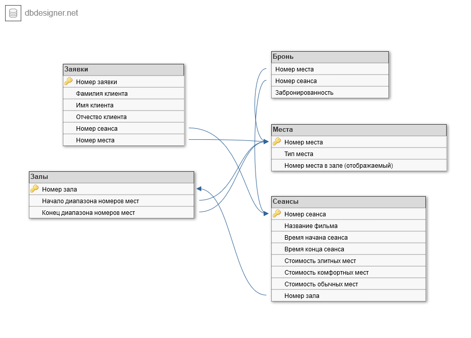

# Пояснительная записка

## 0. Введение

Пишется по завершению проектирования и реализации информационной системы.

1. Цель
2. Задачи

## 1. Анализ ТЗ

### 1.1. Формулировка задания на КР

Целью курсовой работы является проектирование и реализация базы данных "Система бронирования билетов в кинотеатре". Курсовой проект отражает этапы создания базы данных с использованием СУБД FireBird 2.5, а также клиентского приложения. Для того, чтобы выполнить поставленную цель, были сформулированы следующие задачи:

1. Провести анализ предметной области.
2. Разработать формальные требования к хранимым в БД данным.
3. Разработать структуру БД.
4. Разработать клиентское приложение.

### 1.2. Описание предметной области

В данной курсовой работе под кинотеатром будем понимать предприятие, имеющее зрительные залы, предназначенные для показа фильмов. Каждый зал может иметь зрительные места нескольких типов:

* Элитные
* Комфортные
* Обычные

Типы мест различаются комфортом просмотра фильма из-за разницы в удобстве обзора. По этой причине они также различаются стоимостью.

Зрительное место может быть забронировано или свободно для продажи.

Для бронирования билета в кинотеатр клиенту необходимо указать сеанс, тип зрительного места и, при желании, конкретное место (с учетом уже забронированных). Также кинотеатр обеспечивает возможность отмена брони.

Для того, чтобы попасть на сеанс, клиент должен выкупить билет не позднее начала сеанса.

Таким образом, работа кинотеатра по бронированию заключается в следующих процессах:

1. Бронирование билета клиентом. Для этого процесса необходимо хранить следущие данные:
    * Ф.И.О. клиента
    * Телефон клиента
    * Сеанс, на который клиент забронировал билет
    * Место, выбранное клиентом
2. Контроль заполненности зала для каждого сеанса. Для этого процесса необходимо хранить следущие данные:
    * Количество доступных мест в каждой зоне комфортности
    * Заполненность каждого конкретного места (наличие брони на него)
3. Предоставление клиенту информации о будущих сеансах. Для этого процесса необходимо хранить следущие данные:
    * Название фильма и информация о нем
    * Время проведения сеанса
    * Цены на доступные для брони места в зале

### 1.3. Движение потоков данных

При использовании создаваемой базы данных для бронирования билетов будет происходить обмен данных между клиентом и компанией, использующей созданную информационную систему.

Этот обмен заключается в следующих процессах:

1. Передача клиентом информации о желаемом сеансе, типе зрительного места и, при желании, конкретного места
2. Предоставление кинотеатром информации о предстоящих сеансах, заполненности зала и цене доступных для брони мест

### 1.4. Обзор аналогов

#### 1.4.1. Ticket Soft:Кинотеатр (и Ticket Soft:Web Sales)

Ticket Soft - система управления кинотеатрами и мультиплексами, театрами, киноконцертными комплексами, занимающая примерно 10% на рынке всех кинотеатров России.

Ticket Soft:Кинотеатр (и Ticket Soft:Web Sales) позволяет:

1. Продавать и бронировать билеты в соответствии с требованиями 54-ФЗ и 193-ФЗ с помощью единой билетной кассе на POS-терминале и через интернет
2. Контролировать заполненность зала с помощью визуального редактора
3. Предоставлять клиенту информацию о предстоящих сеансах в том числе с помощью монитора зрителя

## 2. Проектировние базы данных

### 2.1. Создание предварительных отношений

#### 2.1.1. Заявки

Для обеспечения пользователям базы данных возможности добавления залов, у каждого зала есть диапазон номеров мест. Таким образом, чтобы узнать, какому залу принадлежит место, необходимо сделать запрос к отношению Залы.

Таблица 1 - отношение Заявки

| Номер заявки | Ф.И.О. клиента | Номер сеанса | Номер места |
| - | - | - | - |
| 1 | И.И.И. | 1 | 1 |

#### 2.1.2. Сеансы

Таблица 2 - отношение Сеансы

| Номер сеанса | Название фильма | Время начала сеанса | Время конца сеанса | Стоимость элитных мест | Стоимость комфортных мест | Стоимость обычных мест | Номер зала |
| - | - | - | - | - | - | - | - |
| 1 | фильм | 16.07 | 17.01 | 150 | 100 | 50 | 1 |

#### 2.1.3. Залы

Таблица 3 - отношение Залы

| Номер зала | Начало диапазона номеров мест | Конец диапазона номеров мест |
| - | - | - |
| 1 | 1 | 27 |

#### 2.1.4. Места

Таблица 4 - отношение Места

| Номер места | Тип места | Номер места в зале (отображаемый) |
| - | - | - |
| 2 | элит | 2 |
| 17 | обычн | 17 |

#### 2.1.5. Бронь

Таблица 5 - отношение Бронь

| Номер места | Номер сеанса | Забронированность |
| - | - | - |
| 2 | 1 | 1 |
| 17 | 1 | 0 |

### 2.2 Приведение базы данных к первой нормальной форме

Определение: отношение находится в первой нормальной форме, если все его атрибуты являются простыми (имеют единственное значение).
Первое отношение (Заявки) не удовлетворяет требованиям первой нормальной формы, поскольку атрибут Ф.И.О. клиента не является атомарным (имеет несколько значений). Для приведения отношения к нормальной форме добавим атрибуты Фамилия, Имя и Отчество, уберем атрибут Ф.И.О. клиента:

Таблица 6 - отношение Заявки (1НФ)

| Имя атрибута | Тип данных |
| - | - |
| Номер заявки (первичный ключ) | Число |
| Фамилия клиента | Текст |
| Имя клиента | Текст |
| Отчество клиента | Текст |
| Номер сеанса (внешний ключ) | Число |
| Номер места (внешний ключ) | Число |

Второе отношение (Сеансы) удовлетворяет требованиям первой нормальной формы, поскольку каждый его атрибут является атомарным (хранит единственное значение). Следовательно, это отношение остается без изменений.

Таблица 7 - отношение Сеансы (1НФ)

| Имя атрибута | Тип данных |
| - | - |
| Номер сеанса (первичный ключ) | Число |
| Название фильма | Текст |
| Время начала сеанса | Дата и время |
| Время конца сеанса | Дата и время |
| Стоимость элитных мест | Число |
| Стоимость комфортных мест | Число |
| Стоимость обычных мест | Число |
| Номер зала (внешний ключ) | Число |

Третье отношение (Залы) удовлетворяет требованиям первой нормальной формы, поскольку каждый его атрибут является атомарным (хранит единственное значение). Следовательно, это отношение остается без изменений.

Таблица 8 - отношение Залы (1НФ)

| Имя атрибута | Тип данных |
| - | - |
| Номер зала (первичный ключ) | Число |
| Начало диапазона номеров мест | Число |
| Конец диапазона номеров мест | Число |

Четвертое отношени (Места) удовлетворяет требованиям первой нормальной формы, поскольку каждый его атрибут является атомарным (хранит единственное значение). Следовательно, это отношение остается без изменений.

Таблица 9 - отношение Места (1НФ)

| Имя атрибута | Тип данных |
| - | - |
| Номер места (первичный ключ) | Число |
| Тип места | Число |
| Номер места в зале (отображаемый) | Число |

Пятое отношение (Бронь) удовлетворяет требованиям первой нормальной формы, поскольку каждый его атрибут является атомарным (хранит единственное значение). Следовательно, это отношение остается без изменений.

Таблица 9 - отношение Бронь (1НФ)

| Имя атрибута | Тип данных |
| - | - |
| Номер места (первичный ключ) | Число |
| Номер сеанса | Число |
| Забронированность | Число |

### 2.3. Приведение базы данных ко второй нормальной форме

Определение: отношение находится во второй нормальной форме, если оно находится в первой нормальной форме и каждый неключевой атрибут функционально полно зависит от первичного ключа.

Ни один первичный ключ из перечисленных выше отношений не является составным. Следовательно, неключевые атрибуты этих отношений не могут зависеть от первичных ключей полно или не полно; значит, отношения остаются без изменений и считаются приведенными ко второй нормальной форме.

### 2.4. Приведение базы данных к третьей нормальной форме

Определение: отношение находится в третьей нормальной форме, если оно находится во второй нормальной форме и каждый неключевой атрибут нетранзитивно зависит от первичного ключа.
Ни в одном из описанный выше отношений нет транзитивных зависимостей между атрибутами.
Значит, база данных соответствует третьей нормальной форме.

### 2.5. Проектирование логической структуры базы данных

Логическая структура базы данных отображает таблицы базы данных и связи между ними.



Рисунок 1 — логическая структура базы данных

## 2.6. Проектирование физической модели базы данных

Физическая модель базы данных определяет способ размещения данных в среде хранения и способы доступа к этим данным, которые поддерживаются на физическом уровне.

Для того, чтобы преобразовать логическую модель в физическую, следует сформировать SQL-запрос (или несколько запросов) системе управления базой данных. В случае проектируемой информационной системы, SQL-запросы должны быть сформулированы на стандартном языке структурированных запросов с учетом особенностей его реализации в Firebird 2.5.

В результате преобразования логической модели базы данных в запросы на языке SQL было получено два .sql файла (см. Приложение 1, 2).

Листинг 1 — создание таблицы requests (отображение логической сущности Заявки)

```sql
CREATE TABLE requests
(
    r_id VARCHAR(8) NOT NULL,
    r_name VARCHAR(32),
    r_surname VARCHAR(32),
    r_middlename VARCHAR(32),
    rs_id VARCHAR(8) NOT NULL,
    rp_id VARCHAR(8),
    PRIMARY KEY(r_id)
);
```

В приведенном выше Листинге 1 можно видеть, что запрос устанавливает однозначное соответствие между атрибутами сущности Заявки и создаваемыми полями таблицы. Например, атрибут "Отчество" здесь реализован следующим образом:

Листинг 2 — атрибут r_middlename таблицы requests

```sql
r_middlename VARCHAR(32)
```

Для установления связи между таблицами используются SQL-запросы следующего вида:

Листинг 3 — создание внешнего ключа shows_fk0

```sql
ALTER TABLE shows
ADD CONSTRAINT shows_fk0
FOREIGN KEY(sh_id)
REFERENCES halls(h_id);
```

Здесь устанавливается связь между таблицами, отображающими сущности Сеансы и Залы с помощью внешнего ключа shows_fk0 таблицы shows.

В результате выполнения приведенных выше запросов сформируем таблицы базы данных.
